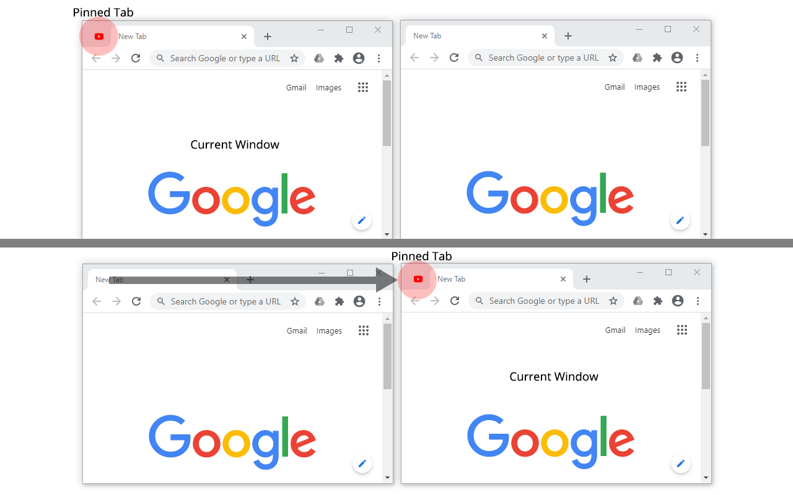

# Active Pinned Tab

When this extension is enabled, pinned tabs will be automatically moved to the current window.

You can pin frequently used tabs (music player, email, IM, etc.) and use them in multiple windows without having to switch to the window where the tab was originally pinned.

Note: Please use "close tabs to the right" instead of "close window", otherwise the pinned tabs in the current window will be closed as well.

## Screenshot

